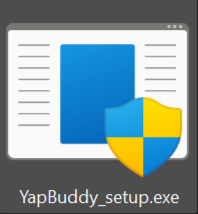
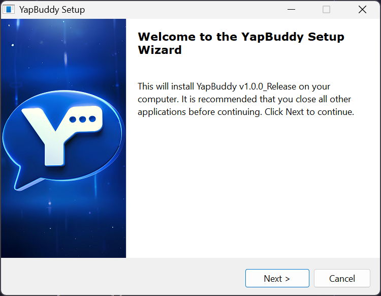
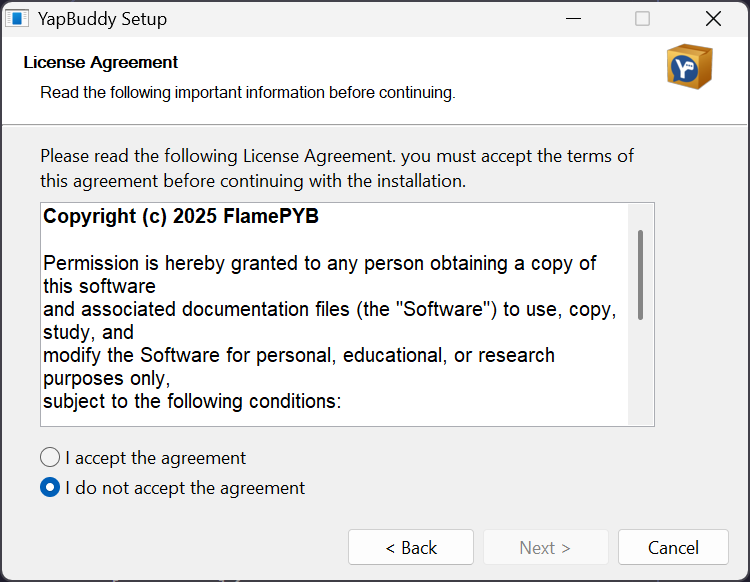
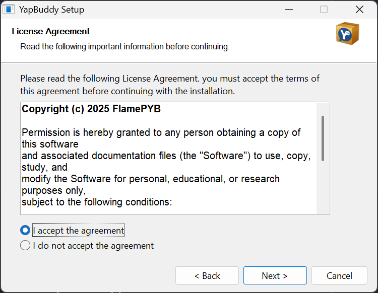
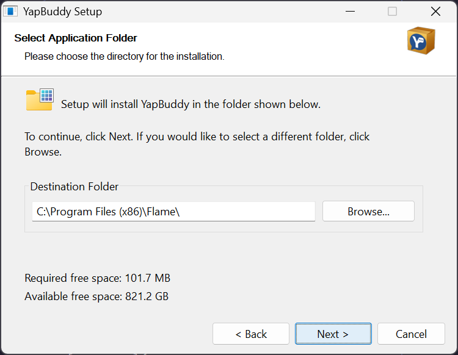
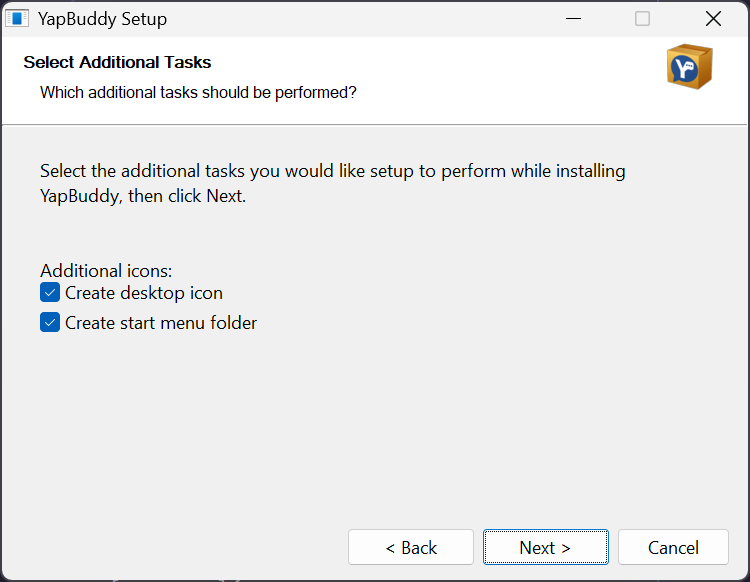
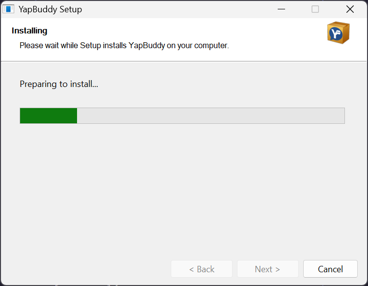
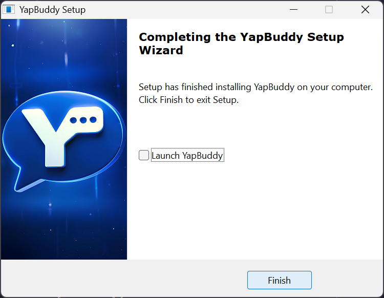
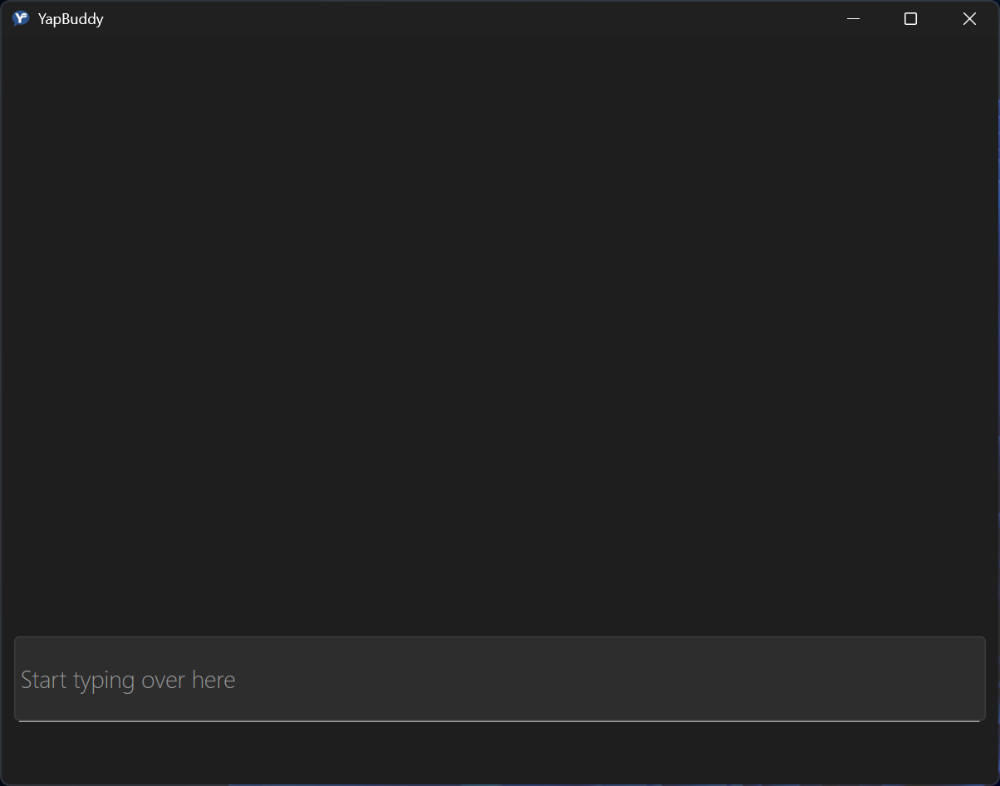
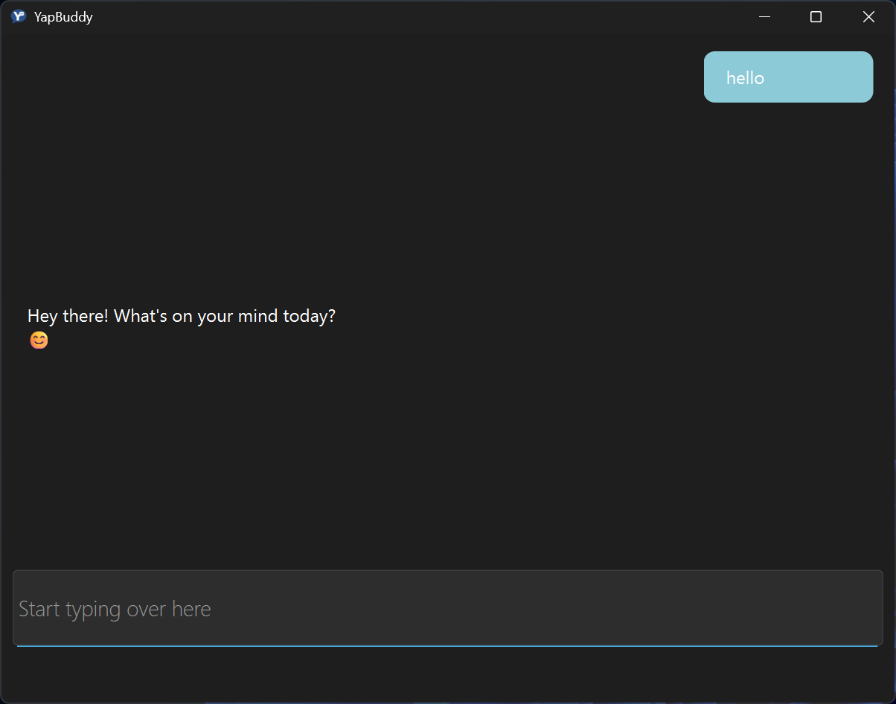

# YapBuddy – Simple Chatbot

## Banner

YapBuddy is a basic gui chatbot project for Windows. This early version is built for learning and experimenting with chatbot logic in Python.

---

## Features

- **Session memory**: Remembers messages only during your current session.
- **No persistent history**: All chat history is wiped when you close the app.
- **Message sender markers**: Distinguishes between user and bot messages.
- **Basic responses**: Handles simple interactions.

## Download options

There are 3 current options to download YapBuddy:

- **Installer :** You download one .exe file and and use it to install the app in the programs or a custom directory. Usually best for casual use
- **Portable :** You download one zipped folder in the .zip format made with all its extensions and supply , and you can unzip it at any given time and use right from there. Best for storing the app long term on a flash drive or just quick use.
- **Ultra-Portable :** A more compressed version than the portable using a .rar extension that provides a better compression protocol. Best for storing on low end external storage devices.

---

## How to Use

1. Download a build from the releases tab.
2. Double-click the `.exe` file.
3. Type your message and press Enter.

## Limitations

- Only remembers conversation context during your session.
- No chat history is saved between sessions.
- Replies are basic; complex interactions may not be handled.
- No animation yet.
- Slow first time start up.
- Occasional IO delay.

---

## Future Plans

- Add persistent memory for conversations.
- Improve response quality.
- Enable the bot to perform simple actions.

---

## Feedback & Contributing

Feedback is welcome! If you have ideas or want to contribute, please open an issue or pull request.

---

## Download

---

| Version | Tag       | Date       | Download |
|---------|-----------|------------|----------|
|Release v1.1.1|`v1.1.1`|2025-4-10|[setup](https://github.com/FlamePYB/YapBuddy/releases/download/v1.1.1-release/YapBuddy_setup.exe) · [portable](https://github.com/FlamePYB/YapBuddy/releases/download/v1.1.1-release/YapBuddy_portable.zip) · [ultra-portable](https://github.com/FlamePYB/YapBuddy/releases/download/v1.1.1-release/YapBuddy_ultra-portable.rar)|
| Beta v1.0.0  | `v1.0.0`  | 2025-09-10 | [standealone](https://github.com/FlamePYB/YapBuddy/releases/download/v1.0.0-beta/YapBuddy-v1.0.0-beta.exe) |
| Alpha v0.1.2  | `v0.3.2`  | 2025-08-15 | [standealone](https://github.com/FlamePYB/YapBuddy/releases/download/v0.3.2-alpha/yapper-v-0-3-2-beta.exe) |
| Alpha v0.1.2  | `v0.1.2`  | 2025-08-01 | [standealone](https://github.com/FlamePYB/YapBuddy/releases/download/v0.1.2-alpha/yapper-v0-1-2-alpha.exe) |
| **Source Code** | `main` | latest release | [ZIP](https://github.com/FlamePYB/YapBuddy/archive/refs/heads/main.zip) · [TAR.GZ](https://github.com/FlamePYB/YapBuddy/archive/refs/heads/main.tar.gz) |

## Setup

### Install

After having installed the app from assets.
You will have a file similar to this

You will want to double click it or open it in a similar way , and then give it admin access. After opening you would see a dialog start up like this
 
and then you will just follow through with the steps

### Use

And now it's time for the use which is the simplest.
Just open it:

And then start typing

And enter when done

